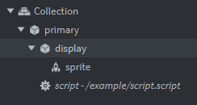

# Say hello to Annie 👋
Annie is a utility module written for the Defold game engine that provides some basic functions to make working with atlases that contain animation groups that consist of 2D sprites with differing uniform dimensions easier to align.

The main utilities of Annie are:
- basic animation switch for lightweight integration into responsive logic in your `update()` (Annie doesn't send the `'play_animation'` message if already playing the animation)
- ability to bypass the animation switch, forcing a replay of the current animation
- automatic alignment of the parent gameobject on playing an animation
- ability to lock and unlock animations
- ability to retain the cursor position between different animations

Currently Annie's main purpose is to assist with aligning animation groups to each other.

# Say what now? 🤔
This description is a bit of a mouthful...
>animation groups that consist of 2D sprites with differing uniform dimensions

If you're having trouble understanding what this means, here's a practical description of the problem Annie tries to solve.

Imagine you have a tall sprite:


And a wide sprite:


For these sprites, you want to keep the circle aligned to the origin of your main gameobject.
To achieve this, you would need to:
- move the wide sprite to the left at runtime
- move the tall sprite up at runtime

Since a sprite component's position can't be altered by scripting at runtime, you need to child the sprite component to a gameobject and manipulate that gameoject's position instead.

For a larger number of animations that don't have the same size, it becomes quickly apparent that if you don't come up with a manageable data structure to source these position offsets from, things might get messy!

Annie was originally written to solve this exact problem, and it solved the problem so well that I started added more features that take care of common techniques that I found myself using that took advantage of being integrated with Annie's auto-alignment utility!

# Usage

## 1. Installation

To get started with Annie, assign her install function in the `init()` of a script component.

```lua
local annie = require 'annie.annie'

function init(self)
    self.annie = annie.install([animation_set], [data])
end
```

The Annie instance is returned as a table that has some important values:
```lua
annie = {
    objects = {},
    sprites = {},
    animation_set = animation_set 
    current_animation = ''
    last_animation = ''
    locked = false
    linked_timers = {}
    cursor = 0
    -- API functions not listed here, but this is where they live
}
```

Both parameters of the install function are optional. Excluding them from your call will disable Annie's auto-alignment utility.

The `animation_set` parameter is used internally as a key for a value lookup that corresponds to your hardcoded animation data.
Annie looks for a value that matches your `animation_set` from a table within Annie's module with the key `'data'`.
You can override this internal lookup and provide the Annie instance being installed with it's own *unique* data by using the `data` parameter of the install function.

In either case, your animation data for Annie should be a table that follows this structure:
```lua
{
    arbitrary_readable_name = { -- this is what Annie looks for with the animation_set parameter
        animation = { -- this key needs to match the animation_id in the atlas
            0, --> in pixels, the X value that Annie will set the position of linked objects to (offset)
            0, --> in pixels, the Y value that Annie will set the position of linked objects to (offset)
            keep_cursor = {} --> optional field containing strings that match animation_ids in the atlas
        }
    },

    another_animation_set = {
        my_animation = {
            0,
            0        
        },
        another_animation = {
            0,
            0,
            keep_cursor = {'my_animation'}
        }
    },

    -- etc.
}
```
If an animation doesn't need an offset, you don't need to include it at all. Annie will automatically add an entry for the missing data!

*Important:* This 'automatic data creation' does of course have a small overhead. If you *really* need to remove it, Annie will not break as long as *ALL* animations that are played through Annie are provided in the data.

For large projects where atlases contain numerous animation groups, or a larger number of distinct objects need to have Annie installed, the following procedure to manage your animation data is recommended:
>Serialize your animation sets into separate files and either
>1. write a deserializer that consolidates them into a single table to feed into Annie at runtime
>2. or require the relevant file in the script installing Annie, then pass the data into the `data` parameter

## 2. Implementing Annie

Annie tries not to assume what specific skills of hers that you need, and her features are compartmentalized where possible. To make customization of Annie's usage possible, many of her utilities are exposed and it is up to you to implement them. However, there are some higher-level assumptions made to make instance management easy and intuitive.

### 2a. Linking gameobjects and sprites to Annie
***
An installed Annie instance needs to know which gameobjects she should worry about.
Usually, it makes sense for your main script to be attached to a 'primary' gameobject for which the main positional updates are handled through.
A 'display' gameobject that is a child to this 'primary' gameobject can then be used to handle the offsets for a sprite with non-uniform animation dimensions.
The 'display' gameobject should be linked to Annie.

An example of this hierarchy:



*Very important:*
>Currently, Annie understands each linked gameobject as only having a single sprite component. Please keep this limitation in mind.

To link a single gameobject-sprite pair to Annie:
```lua
self.annie.link('display', '#my_sprite')
```
The first parameter is a `urlstring` passed to `msg.url()` internally.
The second parameter is concatenated to the first parameter, then passed to `msg.url()` internally.
Annie stores the returns of these calls in order to know which gameobjects her internal function calls should affect.
If no second parameter is provided, `'#sprite'` is used by default.

There is also an alternative link function that condenses linking multiple gameobject-sprite pairs into a single call.

If all of your sprites would be represented by the `urlstring` fragment `'#sprite'`:
```lua
self.annie.mlink('a','b','c') -- accepts variable number of parameters
```
This will link gameobjects `a`, `b`, and `c` to Annie, assuming they each have a sprite component named `'sprite'`.

To specify specific sprite names for each gameobject, provide a table:
```lua
self.annie.mlink({
    a = '#some_sprite',
    b = '#another_sprite',
    c = '#sprite_again'
})
```

### 2b. Customizing the `annie.play()` function
***
*Important note:*
>Annie cannot track external changes to relevant factors of her functionality by herself. Annie is meant to be an easy and intuitive replacement for common calls (and their surrounding logic) such as:
>- `msg.post(url, 'play_animation', { id = hash(animation) })`
>- `sprite.play_flipbook(url, hash(animation))`
>
>Using these calls without informing Annie could introduce hard to find bugs if you treat Annie's utilities as a black box, so try not to use them when you've already got Annie in your script! If you still need to use them, make sure to keep your Annie instance updated.

To make Annie's replacement of the above calls intuitive and simple, Annie has a predefined dummy function `annie.play()` that is meant to be overwritten to include Annie's utilities on a per-instance basis. The default function uses only Annie's `annie.play_anim()` utility:
```lua
function annie.play(animation, mode, ...)
    annie.play_anim(animation, mode, ...)
end
```
A common utility that you may need to add to the function is Annie's ability to flip one or both of the offsets from your animation data.

For example, if you had an object where you've offset the animation on the X axis and the object can face either left or right. When the object changes the direction it faces, you might need to flip the offsets to keep it aligned to the origin of the parent gameobject by the same factors when mirrored.

To add this functionality, simply overwrite the `annie.play()` function and add it in after Annie's installation:
```lua
local annie = require 'annie.annie'

function init(self)
    self.annie = annie.install([animation_set], [data])
    
    function self.annie.play(animation, mode, ...)
        self.annie.play_anim(animation, mode, ...)
        self.annie.flip_offset([flip_x], [flip_y])
    end
end
```
See the API reference for a usage explanation of `.flip_offset()` and more of Annie's utilities.

*Advanced:*
You can ignore this dummy function and access the utilities with your own external function wrappers if that makes more sense for your use case (inclusion of utilities based on game state, for example). However, if you do this `annie.lock()` and `annie.unlock()` cannot be used for their secondary function of playing an animation while locking/unlocking the instance since they call `annie.play()` for this, and you will also need to overwrite `annie.animation_done()` if you want to keep this functionality.

## 3. Locking and unlocking the Annie instance
***
It is possible to 'lock' the instance, preventing the internal state from being changed and disabling the ability to play animations altogether:
```lua
self.annie.lock()
self.annie.unlock()
```
Useful if you want to integrate the state of the instance into your game logic.

Both functions will also attempt to call `annie.play()`, useful for keeping your code compact!

## 4. Features around `animation_done`
***
To make use of built-in utilities that involve the `animation_done` message, add `annie.animation_done()` to your script's `on_message()`:
```lua
function on_message(self, message_id, message, sender)
    if message_id == hash('animation_done') then
        self.annie.animation_done()
    end
end
```

Sometimes, you may want to link timers to your animation to cancel them when the animation is finished. Annie provides a place to store timer handles and a method to cancel them through the instance, which could make it easier to manage and keep track of depending on your use case:
```lua
local my_timer = timer.delay(1, false, function() print('I\'m a linked timer!') end)
self.annie.add_linked_timer(my_timer)
```

By default, `annie.animation_done()` also unlocks the instance.
Either behaviour can be removed or replaced by overwriting the function.

# API
The API is used by calling functions from the installed Annie instance.
***
## `annie.link(urlstring, sprite_name)`
Links a gameobject-sprite pair to the instance.
### PARAMETERS
- `urlstring` - (string) passed to `msg.url()` internally. [See Defold API](https://defold.com/ref/stable/msg/?q=msg.url#msg.url:urlstring).
- `sprite_name` - `optional` (string) the [fragment] part of `urlstring` that corresponds to the gameobject's sprite. Uses `'#sprite` if none are provided.
### RETURN
- `object` - (url) the return of the `msg.url()` call provided with the gameobject urlstring
- `sprite` - (url) the return of the `msg.url()` call provided with the sprite component urlstring
***
## `annie.mlink(...)`
Links any number of gameobject-sprite pairs to the instance, using sprite name `'sprite'`.
### PARAMETERS
- `...` - urlstrings passed to `msg.url()` internally. [See Defold API](https://defold.com/ref/stable/msg/?q=msg.url#msg.url:urlstring).
### RETURN
- (table) containing an array of only the gameobject-sprite components linked by this specific call represented as 2 tables of equal length starting with index 1:
```lua
{
    objects = {
        1 = url: [socket:/path]
    },
    sprites = {
        1 = url: [socket:/path#fragment]
    }
}
```
***
## `annie.mlink(t)`
Links gameobject-sprite pairs to the instance using table keys as the urlstring and values as the sprite name. Calls `annie.link()` internally to accomplish this.
### PARAMETERS
- `t` - (table) with keys as the [path] of the urlstring, values as the [fragment]: `{path = fragment}`
### RETURN
- (table) containing an array of only the gameobject-sprite components linked by this specific call represented as 2 tables of equal length starting with index 1:
```lua
{
    objects = {
        1 = url: [socket:/path]
    },
    sprites = {
        1 = url: [socket:/path#fragment]
    }
}
```
***
## `annie.play_anim(animation, mode, ...)`
Plays an animation.
Attempts to index provided animation data for offsets to use.
Variable utility by passing `mode`.
### PARAMETERS
- `animation` - (string) the animation_id to use internally with `msg.post()`. [See Defold API](https://defold.com/ref/stable/msg/?q=msg.post#msg.post:receiver-message_id-[message])
- `mode` - `optional` (hash):
    - `hash('keep_cursor')` - keeps the cursor position if the last animation matches any of the parameters passed with `...` or from the provided animation data if there are none passed
    - `hash('force_replay')` - forces the animation message to be sent even if the current animation matches the animation you are trying to play
- `...` - `optional` additional parameters used by logic determined by `mode`
***
## `annie.offset(x, y)`
Sets the position of each linked gameobject with `go.set_position()` [See Defold API](https://defold.com/ref/stable/go/?q=go.set_position#go.set_position:position-[id])
### PARAMETERS
- `x` - (number) the X position to set
- `y` - (number) the Y position to set
***
## `annie.offset(t)`
Sets the position of each linked gameobject with `go.set_position()` [See Defold API](https://defold.com/ref/stable/go/?q=go.set_position#go.set_position:position-[id])
### PARAMETERS
- `t` - (table) the X and Y positions to set: `{x,y}`
***
## `annie.set_cursor(cursor)`
Sets the cursor position of each linked sprite using `go.animate()` [See Defold API](https://defold.com/ref/stable/go/?q=go.animate#go.animate:url-property-playback-to-easing-duration-[delay]-[complete_function])
### PARAMETERS
- `cursor` - (number) cursor position to set (must be >=0 & <=1)
***
## `annie.flip_offset(flip_x, flip_y)`
Multiplies the affected value in the position vector3 of linked gameobjects by -1 and sets their positions. This is done *after* the initial auto-alignment from `annie.play_anim()`, so unless your animation data changes the output will always be the same! In other words, you should be tracking the flip state in your game logic, NOT with Annie!
Disabled when the instance is locked.
### PARAMETERS
- `flip_x` - (boolean) true to flip the X offset
- `flip_y` - (boolean) true to flip the Y offset
***
## `annie.lock(animation, mode, ...)`
Attempts to call `annie.play()` if an animation is provided, then locks the instance.
### PARAMETERS
See `annie.play_anim()`
***
## `annie.unlock(animation, mode, ...)`
Unlocks the instance, then attempts to call `annie.play()` if an animation is provided.
### PARAMETERS
See `annie.play_anim()`

# Author
rocamocha

# License
MIT

# To-Do

- Improve internal functions to allow Annie to affect gameobjects with multiple sprite components.
- Add functionality for a separate alignment relative to the grandparent gameobject.
- Decouple the alignment structure and expose it in a way that makes advanced usage intuitive.
- Make the animation cursor usable through Annie's public access. (She doesn't have an `update()` right now so the `annie.cursor` value is only used internally for the `keep_cursor` animation mode).

